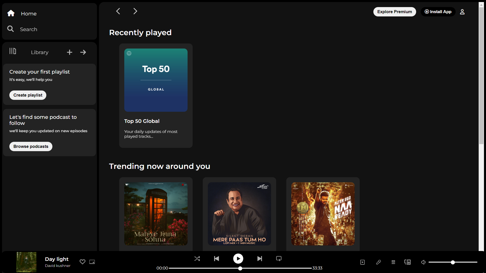

# Spotify Clone

Welcome to the Spotify Clone project! This project aims to replicate the basic design of the popular music streaming platform, Spotify. You can use this clone as a starting point to explore and implement your own features or simply as a learning resource.

## Preview



## Getting Started

To get started with the Spotify Clone, follow these steps:

1. **Clone the Repository:**
   ```bash
   git clone https://github.com/ShashidharM0118/spotify_clone.git
